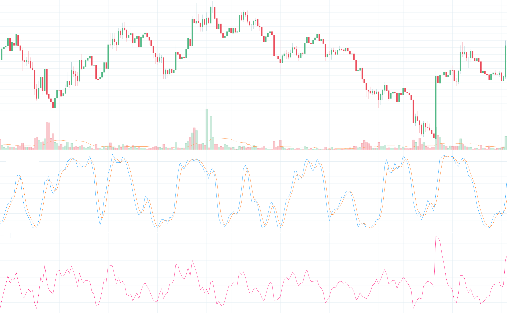
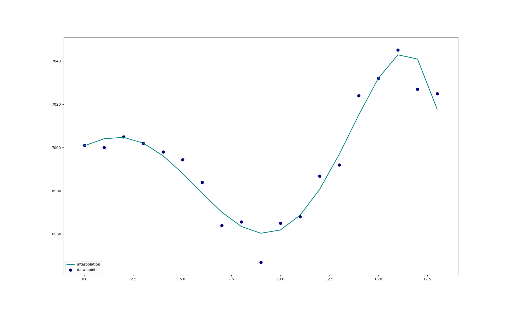

# LSTM-Cryptonalysis
The goal of this project is predicting the price trend of Bitcoin using an lstm-RNN. Technical analysis is applied to historical BTC data in attempt to extract price action for automated trading. The output of the network will indicate and upward or downward trend regarding the next period and will be used to trade Bitcoin throught the Binance API.

### requirements
* [python-binance](https://github.com/sammchardy/python-binance)
* Keras (RNN)
* Scikit (polynomial interpolation)
* numpy
* scipy (savgol filter)
* plotly and matplotlib (if designanted graphing flag is set)

## Label
The price of Bitcoin tends to be very volatile and sporadic making it difficult to find underlying trends and predict price reversals. In order to smooth the historical price data without introducing latency, a [Savitzky-Golay filter](https://docs.scipy.org/doc/scipy-0.16.1/reference/generated/scipy.signal.savgol_filter.html) is applied. The purpose of this filter is to smooth the data without greatly distorting the signal. This is done by fitting sub-sets of adjacent data points with a low-degree polynomial by the method of linear least squares. This filter looks forward into the data so it can only be used to generate labels on historic data. The first-order derivative is then taken to find the slope of the filtered data to indicate upwards and downwards movements about the zero axis. This can be seen in the following figure:    
     

    
## Features
The following features will be used for the lstm-RNN

* MACD histogram
* Stochastic RSI
* Detrended Price Oscillator
* Coppock Curve
* Interpolation of price
    
   

An approximation of the next price is performed using ridge regression from Scikit-learn. Through polynomial interpolation, the price can be treated as a continuous function and the next value in a series can be approximated. Instead of taking the next predicted value in the set, the slope of the last value is found to indicate onward price direction. This approximated value will be fed into the network along with the other features to predict the output label.

## Results
The results so far are somewhat promising. The validation accuracy of the network is ~~just above 70%~~ almost 80% after adding a couple more indicators and ensuring an equal amount of training labels. This can be helpful in market analysis but cannot be used for automated trading due to false positives and network error. Adding features and have better training data should improve the model.

*All code developed by Kurtis Streutker*
   